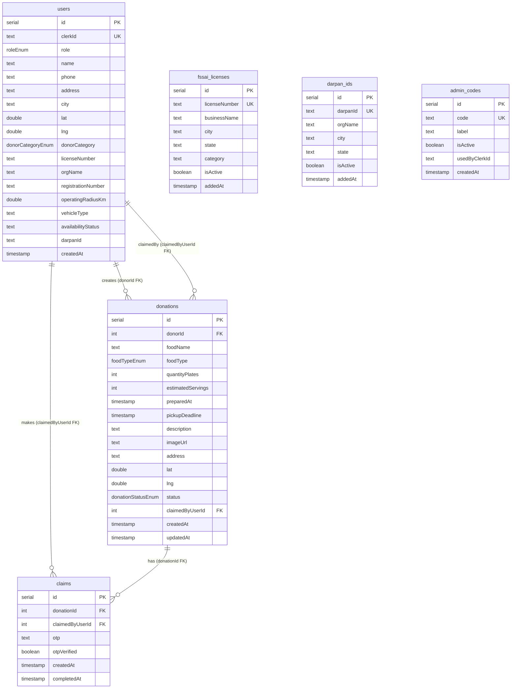
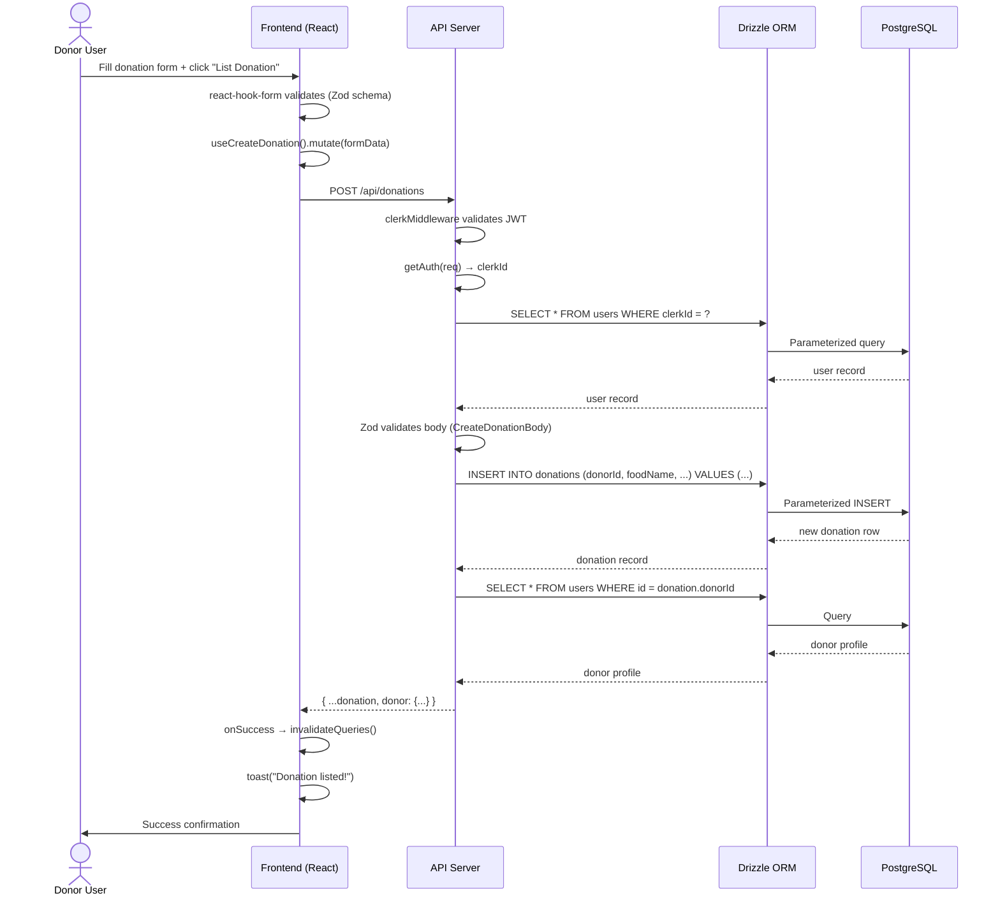
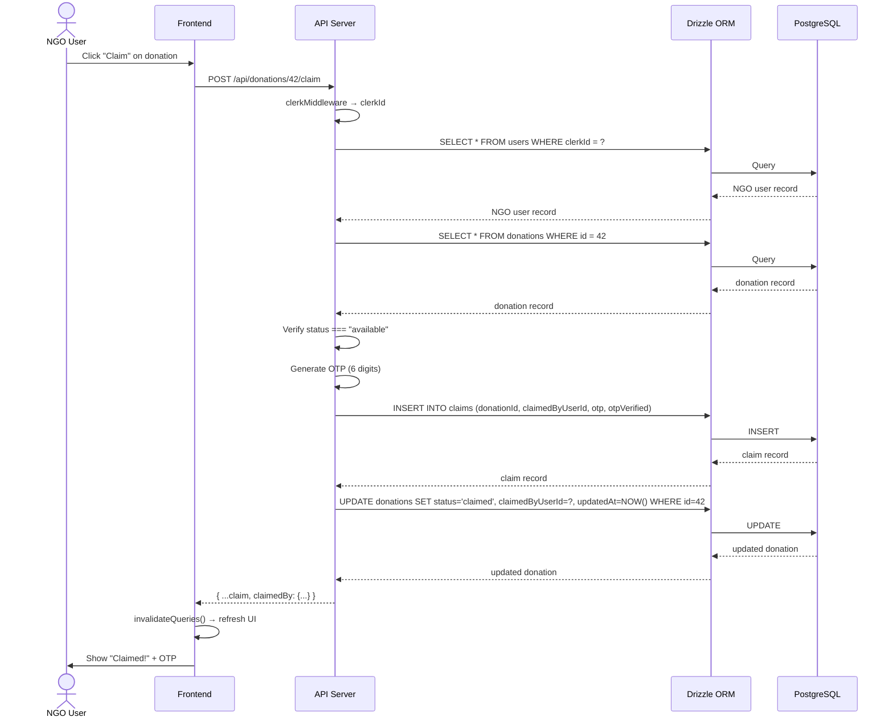
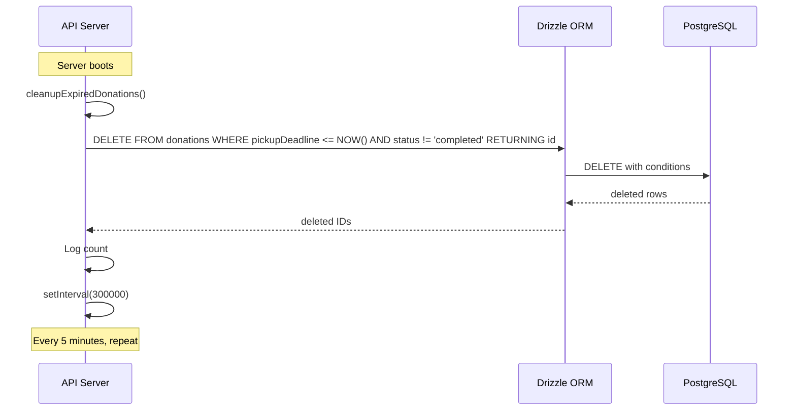
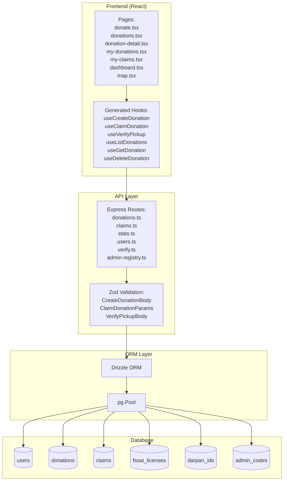

# Database Dictionary — SarthakSetu (सार्थकसेतु)

> **Database**: PostgreSQL
> **ORM**: Drizzle ORM 0.45.2
> **Project**: Food donation platform connecting donors with NGOs and volunteers
> **Generated**: June 2026

---

## Table of Contents

1. [Database Overview](#1-database-overview)
2. [ER Diagram](#2-er-diagram)
3. [Tables](#3-tables)
4. [Relationships](#4-relationships)
5. [Entity Lifecycle](#5-entity-lifecycle)
6. [API Usage](#6-api-usage)
7. [Data Flow](#7-data-flow)
8. [Migrations](#8-migrations)
9. [Performance](#9-performance)
10. [Scalability](#10-scalability)
11. [Future Improvements](#11-future-improvements)

---

## 1. Database Overview

### Database Engine

**PostgreSQL** — relational database with ACID compliance, JSON support, and advanced indexing. Used via the `pg` Node.js driver with connection pooling.

### ORM

**Drizzle ORM** (`drizzle-orm` 0.45.2) with `drizzle-orm/node-postgres` dialect.

Key characteristics:
- **Type-safe**: TypeScript types are inferred from schema definitions
- **SQL-like API**: Query builder closely resembles raw SQL
- **Zero runtime overhead**: No heavy abstraction layer
- **Schema-first**: Tables defined in TypeScript, synced to database

**Connection setup** (`lib/db/src/index.ts`):
```ts
import { drizzle } from "drizzle-orm/node-postgres";
import pg from "pg";
const { Pool } = pg;

export const pool = new Pool({ connectionString: process.env.DATABASE_URL });
export const db = drizzle(pool, { schema });
```

### Migration System

**Drizzle Kit** — schema management via `drizzle-kit`.

- Config file: `lib/db/drizzle.config.ts`
- Schema source: `lib/db/src/schema/index.ts`
- Push command: `pnpm --filter @workspace/db run push`
- **No tracked migration files** — schema is pushed directly to the database
- Migration approach: **Schema-first push** (not versioned migrations)

### Schema Organization

```
lib/db/src/schema/
├── index.ts              # Barrel export of all schemas
├── users.ts              # users table + role/donor_category enums
├── donations.ts          # donations table + food_type/donation_status enums
├── claims.ts             # claims table (OTP handover records)
└── verifications.ts      # fssai_licenses, darpan_ids, admin_codes tables
```

---

## 2. ER Diagram

### Entity Relationship Diagram



### Cardinality Summary

| Relationship | Type | Description |
|-------------|------|-------------|
| users → donations (donorId) | One-to-Many | One donor creates many donations |
| users → claims (claimedByUserId) | One-to-Many | One NGO/volunteer makes many claims |
| donations → claims (donationId) | One-to-Many | One donation has many historical claims |
| users ↔ donations (claimedByUserId) | Many-to-One | Many donations can be claimed by one user |

---

## 3. Tables

---

### `users`

**Purpose**: Stores platform user profiles linked to Clerk authentication accounts.

**Description**: Every person who signs into SarthakSetu gets a `users` record after onboarding. This is the central identity table. The `clerkId` field links to Clerk's user management system. The `role` field determines what the user can do on the platform.

**Primary Key**: `id` (serial, auto-increment)

**Foreign Keys**: None (self-referencing via `clerkId` to external Clerk system)

**Indexes**: None explicitly defined (only automatic PK and UNIQUE indexes)

**Constraints**:
- `clerk_id` — UNIQUE, NOT NULL
- `role` — NOT NULL (enum constraint)
- `name` — NOT NULL
- `phone` — NOT NULL
- `created_at` — NOT NULL, DEFAULT NOW()

#### Columns

| # | Name | Type | Nullable | Default | Description | Used By APIs | Used By Frontend Pages |
|---|------|------|----------|---------|-------------|------------|------------------------|
| 1 | `id` | `serial` | No | Auto-increment | Internal user ID (primary key) | All endpoints that reference users | — |
| 2 | `clerkId` | `text` | No | — | Clerk authentication user ID (external) | `users.ts` (GET/PUT /users/me), all auth checks | `App.tsx` (auth routing), `layout.tsx`, `profile.tsx` |
| 3 | `role` | `role` enum | No | — | User role: donor, ngo, volunteer, admin | `users.ts` (profile upsert), `admin-registry.ts` (admin check) | `onboarding.tsx` (role selection), `layout.tsx` (nav), `dashboard.tsx` (role-based view) |
| 4 | `name` | `text` | No | — | Full display name | `users.ts`, `stats.ts` (enrichment) | `onboarding.tsx`, `profile.tsx`, `dashboard.tsx` |
| 5 | `phone` | `text` | No | — | 10-digit Indian mobile number | `users.ts` | `onboarding.tsx`, `profile.tsx` |
| 6 | `address` | `text` | Yes | — | Street address | `users.ts` | `onboarding.tsx`, `profile.tsx` |
| 7 | `city` | `text` | Yes | — | City name | `users.ts`, `verify.ts` (city matching) | `onboarding.tsx`, `profile.tsx` |
| 8 | `lat` | `double precision` | Yes | — | GPS latitude | `users.ts` | `onboarding.tsx` (map pin), `map.tsx` |
| 9 | `lng` | `double precision` | Yes | — | GPS longitude | `users.ts` | `onboarding.tsx` (map pin), `map.tsx` |
| 10 | `donorCategory` | `donor_category` enum | Yes | — | Donor type: restaurant, hotel, caterer, event_org, household | `users.ts` | `onboarding.tsx` (donor step), `donate.tsx` |
| 11 | `licenseNumber` | `text` | Yes | — | FSSAI license number (business donors) | `users.ts` | `onboarding.tsx` (verification) |
| 12 | `orgName` | `text` | Yes | — | Organization name (NGOs only) | `users.ts` | `onboarding.tsx` (NGO step) |
| 13 | `registrationNumber` | `text` | Yes | — | NGO registration number | `users.ts` | `onboarding.tsx` |
| 14 | `operatingRadiusKm` | `double precision` | Yes | — | Operating radius in km (NGOs) | `users.ts` | `onboarding.tsx` |
| 15 | `vehicleType` | `text` | Yes | — | Vehicle type: bike, auto, car, truck, on_foot | `users.ts` | `onboarding.tsx` (volunteer step) |
| 16 | `availabilityStatus` | `text` | Yes | — | Availability: available, busy, part_time | `users.ts` | `onboarding.tsx` (volunteer step) |
| 17 | `darpanId` | `text` | Yes | — | NITI Aayog Darpan ID (NGOs) | `users.ts` | `onboarding.tsx` (verification) |
| 18 | `createdAt` | `timestamp` | No | `NOW()` | Account creation timestamp | `users.ts`, `stats.ts` | — |

#### Enums Used

| Enum | Values | Column |
|------|--------|--------|
| `role` | donor, ngo, volunteer, admin | `role` |
| `donor_category` | restaurant, hotel, caterer, event_org, household | `donorCategory` |

---

### `donations`

**Purpose**: Stores food donation listings created by donors.

**Description**: The core business entity. When a donor has surplus food, they create a donation record with food details, quantity, pickup location, and deadline. The `status` field tracks the donation through its lifecycle: available → claimed → completed. The auto-cleanup job deletes expired donations every 5 minutes.

**Primary Key**: `id` (serial, auto-increment)

**Foreign Keys**:
- `donorId` → `users.id` (ON DELETE CASCADE)
- `claimedByUserId` → `users.id` (nullable, set when claimed)

**Indexes**: None explicitly defined

**Constraints**:
- `donor_id` — NOT NULL, FK to users.id
- `food_name` — NOT NULL
- `food_type` — NOT NULL (enum: veg, non_veg, both)
- `quantity_plates` — NOT NULL
- `pickup_deadline` — NOT NULL
- `status` — NOT NULL, DEFAULT 'available' (enum: available, claimed, picked_up, completed)
- `created_at` — NOT NULL, DEFAULT NOW()
- `updated_at` — NOT NULL, DEFAULT NOW()

#### Columns

| # | Name | Type | Nullable | Default | Description | Used By APIs | Used By Frontend Pages |
|---|------|------|----------|---------|-------------|------------|------------------------|
| 1 | `id` | `serial` | No | Auto-increment | Donation ID (primary key) | All donation endpoints | `donations.tsx`, `donation-detail.tsx`, `map.tsx`, `my-donations.tsx` |
| 2 | `donorId` | `integer` | No | — | FK to users.id (who created it) | `donations.ts` (CREATE, LIST, MY, DETAIL, PATCH, DELETE) | `donate.tsx` (implicit via auth) |
| 3 | `foodName` | `text` | No | — | Name/description of the food | `donations.ts` | `donate.tsx` (form), `donations.tsx`, `donation-detail.tsx` |
| 4 | `foodType` | `food_type` enum | No | — | veg, non_veg, both | `donations.ts` (filter) | `donate.tsx` (form), `donations.tsx` (filter badge) |
| 5 | `quantityPlates` | `integer` | No | — | Number of plates available | `donations.ts`, `stats.ts` | `donate.tsx` (form), `donation-detail.tsx`, `dashboard.tsx` |
| 6 | `estimatedServings` | `integer` | Yes | — | Estimated people that can be served | `donations.ts` | `donate.tsx` (form) |
| 7 | `preparedAt` | `timestamp` | Yes | — | When the food was prepared | `donations.ts` | `donate.tsx` (form), `donation-detail.tsx` |
| 8 | `pickupDeadline` | `timestamp` | No | — | Must be picked up by this time | `donations.ts`, `index.ts` (cleanup job) | `donate.tsx` (form), `donation-detail.tsx`, `donations.tsx` |
| 9 | `description` | `text` | Yes | — | Additional details about the food | `donations.ts` | `donate.tsx` (form), `donation-detail.tsx` |
| 10 | `imageUrl` | `text` | Yes | — | URL to a photo of the food | `donations.ts` | `donate.tsx` (form), `donations.tsx`, `donation-detail.tsx` |
| 11 | `address` | `text` | Yes | — | Human-readable pickup address | `donations.ts` | `donate.tsx` (form), `donation-detail.tsx`, `map.tsx` |
| 12 | `lat` | `double precision` | Yes | — | Pickup location latitude | `donations.ts` | `donate.tsx` (map picker), `map.tsx` (marker) |
| 13 | `lng` | `double precision` | Yes | — | Pickup location longitude | `donations.ts` | `donate.tsx` (map picker), `map.tsx` (marker) |
| 14 | `status` | `donation_status` enum | No | `available` | available, claimed, picked_up, completed | `donations.ts` (filter, update), `claims.ts` (state machine), `stats.ts` | All donation-related pages |
| 15 | `claimedByUserId` | `integer` | Yes | — | FK to users.id (who claimed it) | `donations.ts`, `claims.ts` | `donation-detail.tsx` (shows claimer) |
| 16 | `createdAt` | `timestamp` | No | `NOW()` | When the listing was created | `donations.ts` (sort) | `donations.tsx`, `donation-detail.tsx` |
| 17 | `updatedAt` | `timestamp` | No | `NOW()` | Last modification timestamp | `donations.ts` (update) | — |

#### Enums Used

| Enum | Values | Column |
|------|--------|--------|
| `food_type` | veg, non_veg, both | `foodType` |
| `donation_status` | available, claimed, picked_up, completed | `status` |

---

### `claims`

**Purpose**: Records the claim/verification handshake between NGOs and donors.

**Description**: When an NGO claims a donation, a `claims` record is created with a randomly generated 6-digit OTP. The OTP is shared with the donor (via the donation detail page). At physical pickup, the donor enters the OTP to verify completion. The `otpVerified` field tracks whether verification happened. Multiple claims can exist for one donation over time (if claims are cancelled and re-claimed), but only the latest is active.

**Primary Key**: `id` (serial, auto-increment)

**Foreign Keys**:
- `donationId` → `donations.id` (ON DELETE CASCADE)
- `claimedByUserId` → `users.id` (ON DELETE CASCADE)

**Indexes**: None explicitly defined

**Constraints**:
- `donation_id` — NOT NULL, FK to donations.id
- `claimed_by_user_id` — NOT NULL, FK to users.id
- `otp` — NOT NULL
- `otp_verified` — NOT NULL, DEFAULT false
- `created_at` — NOT NULL, DEFAULT NOW()

#### Columns

| # | Name | Type | Nullable | Default | Description | Used By APIs | Used By Frontend Pages |
|---|------|------|----------|---------|-------------|------------|------------------------|
| 1 | `id` | `serial` | No | Auto-increment | Claim record ID (primary key) | `claims.ts` | — |
| 2 | `donationId` | `integer` | No | — | FK to donations.id | `claims.ts` (claim, verify, unclaim, my claims), `donations.ts` (enrichment) | `donation-detail.tsx` (shows claim), `my-claims.tsx` |
| 3 | `claimedByUserId` | `integer` | No | — | FK to users.id (NGO/volunteer who claimed) | `claims.ts` | `donation-detail.tsx`, `my-claims.tsx` |
| 4 | `otp` | `text` | No | — | 6-digit pickup verification code | `claims.ts` (claim creates it, verify checks it), `donations.ts` (enrichment exposes it) | `donation-detail.tsx` (donor sees OTP) |
| 5 | `otpVerified` | `boolean` | No | `false` | Whether the OTP was successfully verified | `claims.ts` (verify sets true), `stats.ts` | `donation-detail.tsx` (status indicator) |
| 6 | `createdAt` | `timestamp` | No | `NOW()` | When the claim was made | `claims.ts` | `my-claims.tsx` |
| 7 | `completedAt` | `timestamp` | Yes | — | When OTP verification happened | `claims.ts` | — |

---

### `fssai_licenses`

**Purpose**: Registry of valid FSSAI (Food Safety and Standards Authority of India) business licenses for donor verification.

**Description**: Pre-populated table of licensed food businesses. During onboarding, donors who select a business category (restaurant, hotel, caterer, event_org) must provide their FSSAI license number. The system checks this table to validate the license. If valid, the donor's `licenseNumber` is stored in their `users` record.

**Primary Key**: `id` (serial, auto-increment)

**Foreign Keys**: None

**Indexes**: None explicitly defined

**Constraints**:
- `license_number` — UNIQUE, NOT NULL
- `business_name` — NOT NULL
- `city` — NOT NULL
- `state` — NOT NULL
- `category` — NOT NULL
- `is_active` — NOT NULL, DEFAULT true
- `added_at` — NOT NULL, DEFAULT NOW()

#### Columns

| # | Name | Type | Nullable | Default | Description | Used By APIs | Used By Frontend Pages |
|---|------|------|----------|---------|-------------|------------|------------------------|
| 1 | `id` | `serial` | No | Auto-increment | Registry entry ID | `admin-registry.ts` (CRUD) | `admin-registry.tsx` |
| 2 | `licenseNumber` | `text` | No | — | Unique FSSAI license number | `verify.ts` (lookup), `admin-registry.ts` | `onboarding.tsx` (donor verification step) |
| 3 | `businessName` | `text` | No | — | Registered business name | `verify.ts` (returns in response) | `onboarding.tsx` (shows after verification) |
| 4 | `city` | `text` | No | — | Business city | `verify.ts` (returns in response) | `onboarding.tsx` |
| 5 | `state` | `text` | No | — | Business state | `verify.ts` (returns in response) | `onboarding.tsx` |
| 6 | `category` | `text` | No | — | Business category (Restaurant, Hotel, etc.) | `verify.ts` | `onboarding.tsx` |
| 7 | `isActive` | `boolean` | No | `true` | Whether this license is still valid | `verify.ts` (checked during validation) | `admin-registry.tsx` (toggle) |
| 8 | `addedAt` | `timestamp` | No | `NOW()` | When the license was added to registry | `admin-registry.ts` (sort) | `admin-registry.tsx` |

**Seed Data**: 10 demo entries (Sharma Ji Dhaba, Mumbai Grand Hotel, Priya Caterers, etc.) are inserted on first run if the table is empty (`seed.ts`).

---

### `darpan_ids`

**Purpose**: Registry of valid NITI Aayog Darpan IDs for NGO verification.

**Description**: Pre-populated table of registered NGOs. During onboarding, users selecting the "NGO" role must provide their Darpan ID. The system checks this table. If valid, the NGO's `orgName`, `city`, and `state` are returned for confirmation, and the `darpanId` is stored in the user's profile.

**Primary Key**: `id` (serial, auto-increment)

**Foreign Keys**: None

**Indexes**: None explicitly defined

**Constraints**:
- `darpan_id` — UNIQUE, NOT NULL
- `org_name` — NOT NULL
- `city` — NOT NULL
- `state` — NOT NULL
- `is_active` — NOT NULL, DEFAULT true
- `added_at` — NOT NULL, DEFAULT NOW()

#### Columns

| # | Name | Type | Nullable | Default | Description | Used By APIs | Used By Frontend Pages |
|---|------|------|----------|---------|-------------|------------|------------------------|
| 1 | `id` | `serial` | No | Auto-increment | Registry entry ID | `admin-registry.ts` (CRUD) | `admin-registry.tsx` |
| 2 | `darpanId` | `text` | No | — | Unique Darpan NGO ID | `verify.ts` (lookup) | `onboarding.tsx` (NGO verification step) |
| 3 | `orgName` | `text` | No | — | Registered organization name | `verify.ts` (returns in response) | `onboarding.tsx` (shows after verification) |
| 4 | `city` | `text` | No | — | NGO city | `verify.ts` (returns in response) | `onboarding.tsx` |
| 5 | `state` | `text` | No | — | NGO state | `verify.ts` (returns in response) | `onboarding.tsx` |
| 6 | `isActive` | `boolean` | No | `true` | Whether this Darpan ID is still valid | `verify.ts` (checked during validation) | `admin-registry.tsx` (toggle) |
| 7 | `addedAt` | `timestamp` | No | `NOW()` | When the ID was added to registry | `admin-registry.ts` (sort) | `admin-registry.tsx` |

**Seed Data**: 10 demo entries (Feeding India Foundation, Robin Hood Army Delhi, Akshaya Patra Bengaluru, etc.) inserted on first run.

---

### `admin_codes`

**Purpose**: Single-use access codes for granting platform admin privileges.

**Description**: When a user selects the "Admin" role during onboarding, they must provide a valid admin code from this table. If verified, their `users.role` is set to `admin`. The `usedByClerkId` field could track which Clerk user consumed a code (currently nullable, not enforced). Admins can manage these codes through the admin registry dashboard.

**Primary Key**: `id` (serial, auto-increment)

**Foreign Keys**: None (the `usedByClerkId` references Clerk IDs, not local users)

**Indexes**: None explicitly defined

**Constraints**:
- `code` — UNIQUE, NOT NULL
- `label` — NOT NULL
- `is_active` — NOT NULL, DEFAULT true
- `created_at` — NOT NULL, DEFAULT NOW()

#### Columns

| # | Name | Type | Nullable | Default | Description | Used By APIs | Used By Frontend Pages |
|---|------|------|----------|---------|-------------|------------|------------------------|
| 1 | `id` | `serial` | No | Auto-increment | Code entry ID | `admin-registry.ts` (CRUD) | `admin-registry.tsx` |
| 2 | `code` | `text` | No | — | Unique admin access code | `verify.ts` (validation) | `onboarding.tsx` (admin verification step) |
| 3 | `label` | `text` | No | — | Human-readable label for the code | `admin-registry.ts` | `admin-registry.tsx` |
| 4 | `isActive` | `boolean` | No | `true` | Whether this code is still usable | `verify.ts` (checked during validation) | `admin-registry.tsx` (toggle) |
| 5 | `usedByClerkId` | `text` | Yes | — | Clerk ID of user who used this code (optional tracking) | — | `admin-registry.tsx` |
| 6 | `createdAt` | `timestamp` | No | `NOW()` | When the code was created | `admin-registry.ts` (sort) | `admin-registry.tsx` |

**Seed Data**: 3 hardcoded demo codes (`ANNSETU_ADMIN_2024`, `PLATFORM_ADMIN_KEY`, `ANNSETU_SUPERADMIN`) inserted on first run. **Security note**: These should be removed in production.

---

## 4. Relationships

### One-to-One

There are **no true one-to-one relationships** in this schema. The `claimedByUserId` on `donations` could be seen as a one-to-one at a given moment in time (one donation is claimed by one user), but historically a donation can have multiple claims (cancelled and re-claimed), making the `claims` table the authoritative many-to-one relationship.

### One-to-Many

#### users → donations (donor creates donations)

```
users (1) ───▶ (many) donations
  FK: donations.donorId → users.id
  ON DELETE CASCADE: If user is deleted, all their donations are deleted
```

**Enforcement**: The foreign key constraint ensures every donation has a valid donor. The `ON DELETE CASCADE` means deleting a user automatically deletes all their donation listings.

**API Endpoints**:
- `GET /api/donations/my` — lists donations WHERE `donorId = currentUser.id`
- `POST /api/donations` — creates with `donorId = currentUser.id`
- `PATCH /api/donations/:id` — checks `existing.donorId === user.id`
- `DELETE /api/donations/:id` — checks `existing.donorId === user.id` or admin

#### users → claims (NGO makes claims)

```
users (1) ───▶ (many) claims
  FK: claims.claimedByUserId → users.id
  ON DELETE CASCADE: If user is deleted, all their claims are deleted
```

**API Endpoints**:
- `GET /api/claims/my` — lists claims WHERE `claimedByUserId = currentUser.id`
- `POST /api/donations/:id/claim` — creates with `claimedByUserId = currentUser.id`

#### donations → claims (donation has claims)

```
donations (1) ───▶ (many) claims
  FK: claims.donationId → donations.id
  ON DELETE CASCADE: If donation is deleted, all its claims are deleted
```

**API Endpoints**:
- `POST /api/donations/:id/claim` — creates with `donationId = :id`
- `POST /api/donations/:id/verify` — finds claim WHERE `donationId = :id`
- `POST /api/donations/:id/unclaim` — finds donation/claim by `donationId`

### Many-to-Many (Decomposed)

The relationship between **NGOs (users)** and **donations** is many-to-many in concept (an NGO can claim many donations, a donation can be claimed by many NGOs over time). This is decomposed into the `claims` junction table rather than a direct many-to-many foreign key.

```
users (ngo) ───▶ claims ◀─── donations
            (junction table)
```

**Why decomposed?** Because claims have their own state (OTP, verified, timestamps). A pure junction table would not support the claim lifecycle. The `claims` table acts as an association entity with attributes.

---

## 5. Entity Lifecycle

### users

#### Created
- Trigger: User completes onboarding form and submits
- API: `PUT /api/users/me`
- Process:
  1. Clerk authenticates the user
  2. Frontend sends profile data (name, phone, role, etc.)
  3. Backend checks if user exists by `clerkId`
  4. If not found: `INSERT INTO users (clerkId, role, name, ...) VALUES (...)`
  5. Returns the created user record

#### Updated
- Trigger: User edits profile or onboarding completes for existing user
- API: `PUT /api/users/me`
- Process:
  1. `SELECT FROM users WHERE clerkId = ?` to find existing
  2. `UPDATE users SET ... WHERE clerkId = ?`
  3. Returns updated record

#### Deleted
- **Not implemented** — no DELETE endpoint for users
- If implemented, `ON DELETE CASCADE` on donations and claims would clean up related data

#### Queried
- `GET /api/users/me` — single user by Clerk ID
- `stats.ts` — multiple lookups by `users.id` for enrichment
- `admin-registry.ts` — admin check by `clerkId`

### donations

#### Created
- Trigger: Donor submits the donation form
- API: `POST /api/donations`
- Process:
  1. Clerk auth validates user
  2. `getDonorUser(clerkId)` finds the donor's `users.id`
  3. Zod validates request body
  4. `INSERT INTO donations (donorId, foodName, foodType, quantityPlates, ..., status) VALUES (...)`
  5. `status` is set to `"available"`
  6. `enrichDonation()` fetches donor profile and returns enriched record

#### Updated
- Trigger: Donor edits their donation
- API: `PATCH /api/donations/:id`
- Process:
  1. Auth check + ownership verification (`existing.donorId === user.id`)
  2. `UPDATE donations SET ... WHERE id = ?`
  3. `updatedAt` set to `new Date()`

#### Deleted
- Trigger: Donor or admin deletes a donation
- API: `DELETE /api/donations/:id`
- Process:
  1. Auth check
  2. Ownership check (owner or admin)
  3. `DELETE FROM donations WHERE id = ?`
  4. Cascade: all related `claims` records are deleted (FK CASCADE)

#### Auto-Deleted (Expired)
- Trigger: Background cleanup job runs every 5 minutes
- Process (`index.ts`):
  ```sql
  DELETE FROM donations
  WHERE pickup_deadline <= NOW()
    AND status != 'completed'
  RETURNING id
  ```
- Cascade: expired donations and their claims are removed

#### Queried
- `GET /api/donations` — list with filters (status, foodType)
- `GET /api/donations/:id` — single donation with enrichment
- `GET /api/donations/my` — donor's own listings
- `GET /api/stats/*` — stats aggregation

### claims

#### Created
- Trigger: NGO clicks "Claim" on a donation
- API: `POST /api/donations/:id/claim`
- Process:
  1. Auth check
  2. Verify donation exists and `status === "available"`
  3. Generate 6-digit OTP: `Math.floor(100000 + Math.random() * 900000)`
  4. `INSERT INTO claims (donationId, claimedByUserId, otp, otpVerified) VALUES (...)`
  5. `UPDATE donations SET status = 'claimed', claimedByUserId = ? WHERE id = ?`
  6. Return claim with OTP

#### Updated
- Trigger: Donor enters OTP to verify pickup
- API: `POST /api/donations/:id/verify`
- Process:
  1. Find latest claim for donation: `SELECT FROM claims WHERE donationId = ? ORDER BY createdAt DESC`
  2. Verify OTP matches
  3. `UPDATE claims SET otpVerified = true, completedAt = NOW() WHERE id = ?`
  4. `UPDATE donations SET status = 'completed' WHERE id = ?`

#### Deleted
- Trigger: NGO clicks "Unclaim" or donation is deleted
- API: `POST /api/donations/:id/unclaim`
- Process:
  1. Find donation where `claimedByUserId = currentUser.id`
  2. `UPDATE donations SET status = 'available', claimedByUserId = null WHERE id = ?`
  3. Claim record is **not deleted** — kept for history
- Cascade: If parent donation is deleted, claims are deleted via FK CASCADE

#### Queried
- `GET /api/claims/my` — current user's claims with donation enrichment
- `donations.ts` — latest claim fetched for enrichment (OTP lookup)
- `stats.ts` — claims counted for NGO stats

### fssai_licenses / darpan_ids / admin_codes

#### Created
- Trigger: Admin adds a new verification entry
- API: `POST /api/admin/registry/fssai` (or darpan, codes)
- Process:
  1. Admin auth check (`requireAdmin()`)
  2. Zod validates body
  3. `INSERT INTO ... VALUES (...).onConflictDoNothing()`

#### Updated
- **Not implemented** — no UPDATE endpoints for verification registries
- Admins must delete and re-add to change values
- `isActive` flag could be toggled but no endpoint exists for it

#### Deleted
- Trigger: Admin removes a verification entry
- API: `DELETE /api/admin/registry/fssai/:id`
- Process:
  1. Admin auth check
  2. `DELETE FROM fssai_licenses WHERE id = ?`

#### Queried
- `GET /api/admin/registry/*` — admin lists all entries
- `POST /api/verify/*` — public lookup during onboarding

---

## 6. API Usage

### users Table

| Operation | Endpoints | HTTP Method | Description |
|-----------|-----------|-------------|-------------|
| **Read** | `GET /api/users/me` | GET | Current user's profile by Clerk ID |
| **Write** | `PUT /api/users/me` | PUT | Create or update profile |
| **Read (internal)** | `stats.ts`, `donations.ts`, `claims.ts`, `admin-registry.ts` | — | Enrichment lookups by `users.id` |

### donations Table

| Operation | Endpoints | HTTP Method | Description |
|-----------|-----------|-------------|-------------|
| **Read** | `GET /api/donations` | GET | List all donations (public, filtered) |
| **Read** | `GET /api/donations/:id` | GET | Single donation with enrichment |
| **Read** | `GET /api/donations/my` | GET | Current donor's listings |
| **Read** | `GET /api/stats/*` | GET | Aggregate stats |
| **Write** | `POST /api/donations` | POST | Create new donation |
| **Write** | `PATCH /api/donations/:id` | PATCH | Update own donation |
| **Write** | `DELETE /api/donations/:id` | DELETE | Delete own donation (or admin) |
| **Write (internal)** | `claims.ts` — claim, verify, unclaim | POST | Status updates |
| **Write (internal)** | `index.ts` — cleanup job | Background | Auto-delete expired |

### claims Table

| Operation | Endpoints | HTTP Method | Description |
|-----------|-----------|-------------|-------------|
| **Read** | `GET /api/claims/my` | GET | Current user's claims |
| **Read (internal)** | `donations.ts` — `enrichDonation()` | — | Fetch latest claim for OTP |
| **Read (internal)** | `stats.ts` | — | Count claims for NGO stats |
| **Write** | `POST /api/donations/:id/claim` | POST | Create claim + generate OTP |
| **Write** | `POST /api/donations/:id/verify` | POST | Verify OTP, mark complete |
| **Write** | `POST /api/donations/:id/unclaim` | POST | Release claim |

### fssai_licenses Table

| Operation | Endpoints | HTTP Method | Description |
|-----------|-----------|-------------|-------------|
| **Read** | `GET /api/admin/registry/fssai` | GET | Admin lists all |
| **Read** | `POST /api/verify/fssai` | POST | Public verification lookup |
| **Write** | `POST /api/admin/registry/fssai` | POST | Admin adds entry |
| **Write** | `DELETE /api/admin/registry/fssai/:id` | DELETE | Admin removes entry |

### darpan_ids Table

| Operation | Endpoints | HTTP Method | Description |
|-----------|-----------|-------------|-------------|
| **Read** | `GET /api/admin/registry/darpan` | GET | Admin lists all |
| **Read** | `POST /api/verify/darpan` | POST | Public verification lookup |
| **Write** | `POST /api/admin/registry/darpan` | POST | Admin adds entry |
| **Write** | `DELETE /api/admin/registry/darpan/:id` | DELETE | Admin removes entry |

### admin_codes Table

| Operation | Endpoints | HTTP Method | Description |
|-----------|-----------|-------------|-------------|
| **Read** | `GET /api/admin/registry/codes` | GET | Admin lists all |
| **Read** | `POST /api/verify/admin-code` | POST | Public verification lookup |
| **Write** | `POST /api/admin/registry/codes` | POST | Admin adds entry |
| **Write** | `DELETE /api/admin/registry/codes/:id` | DELETE | Admin removes entry |

---

## 7. Data Flow

### Complete Request Flow: Create a Donation



### Complete Request Flow: Claim a Donation



### Data Flow: Auto-Cleanup of Expired Donations



### Frontend → Database Data Flow Summary



---

## 8. Migrations

### Migration System

**Tool**: Drizzle Kit
**Config**: `lib/db/drizzle.config.ts`
**Command**: `pnpm --filter @workspace/db run push`

```ts
import { defineConfig } from "drizzle-kit";
export default defineConfig({
  schema: "./src/schema/index.ts",
  dialect: "postgresql",
  dbCredentials: { url: process.env.DATABASE_URL },
});
```

### Migration Approach

The project uses **schema-first push** rather than versioned migrations:

1. Developer modifies schema files (`lib/db/src/schema/*.ts`)
2. Runs `pnpm --filter @workspace/db run push`
3. Drizzle Kit compares current schema to database state
4. Generates and executes ALTER statements to sync

**No tracked migration files** exist in the repository. There is no `migrations/` folder with timestamped `.sql` files.

### Schema Evolution History (Inferred)

Based on the current schema, the following logical evolution is apparent:

1. **Initial schema**: `users`, `donations`, `claims` tables created
2. **Verification tables added**: `fssai_licenses`, `darpan_ids`, `admin_codes`
3. **Status field expanded**: `donation_status` enum expanded from basic states to include `picked_up`
4. **Enrichment fields added**: `claimedByUserId` added to `donations` for quick lookups
5. **Stats support**: Various fields added for dashboard statistics

### Seed Data

**File**: `artifacts/api-server/src/lib/seed.ts`

On first server startup, if verification tables are empty:
- 10 FSSAI licenses inserted (demo restaurants, hotels, caterers)
- 10 Darpan IDs inserted (demo NGOs)
- 3 admin codes inserted (demo admin access codes)

All inserts use `.onConflictDoNothing()` to avoid duplicates on restarts.

### Auto-Cleanup Job

**File**: `artifacts/api-server/src/index.ts` (lines 25–47)

A background job runs every 5 minutes:
```ts
setInterval(cleanupExpiredDonations, 5 * 60 * 1000);
```

This is **not a schema-level migration** but a runtime data maintenance operation. No database triggers or scheduled jobs are used.

---

## 9. Performance

### Current Index Usage

The schema relies entirely on **automatic indexes** created by PostgreSQL:

| Index Type | Created On | Reason |
|-----------|------------|--------|
| PRIMARY KEY | `id` columns | Auto-created for all tables |
| UNIQUE | `users.clerk_id` | UNIQUE constraint |
| UNIQUE | `fssai_licenses.license_number` | UNIQUE constraint |
| UNIQUE | `darpan_ids.darpan_id` | UNIQUE constraint |
| UNIQUE | `admin_codes.code` | UNIQUE constraint |
| FK Index | `donations.donor_id` | Auto-created by PostgreSQL for FK |
| FK Index | `donations.claimed_by_user_id` | Auto-created by PostgreSQL for FK |
| FK Index | `claims.donation_id` | Auto-created by PostgreSQL for FK |
| FK Index | `claims.claimed_by_user_id` | Auto-created by PostgreSQL for FK |

### Slow Queries Identified

#### 1. Stats endpoint loads entire tables

```ts
// stats.ts lines 153-155
const allUsers = await db.select().from(usersTable);
const allDonations = await db.select().from(donationsTable);
```

**Problem**: `GET /api/stats/platform` fetches ALL rows into application memory, then filters in JavaScript:
```ts
const totalDonors = allUsers.filter((u) => u.role === "donor").length;
const totalPlatesSaved = allDonations
  .filter((d) => d.status === "completed")
  .reduce((s, d) => s + d.quantityPlates, 0);
```

**Impact**: O(users + donations) memory and transfer. At scale, this OOMs the server.

**Fix**: Use SQL aggregates:
```sql
SELECT COUNT(*) FROM users WHERE role = 'donor';
SELECT SUM(quantity_plates) FROM donations WHERE status = 'completed';
```

#### 2. Enrichment N+1 queries

```ts
// donations.ts lines 26-53 — enrichDonation()
async function enrichDonation(donation) {
  const [donor] = await db.select().from(usersTable)
    .where(eq(usersTable.id, donation.donorId)).limit(1);   // Query 1

  let claimedBy = null;
  let otp = null;
  if (donation.claimedByUserId) {
    const [claimer] = await db.select().from(usersTable)   // Query 2
      .where(eq(usersTable.id, donation.claimedByUserId)).limit(1);
    const [latestClaim] = await db.select().from(claimsTable) // Query 3
      .where(eq(claimsTable.donationId, donation.id))
      .orderBy(desc(claimsTable.createdAt)).limit(1);
    otp = latestClaim?.otp ?? null;
  }
  return { ...donation, donor, claimedBy, otp };
}
```

**Problem**: For a list of 50 donations, this performs:
- 50 queries for donors
- Up to 50 queries for claimers
- Up to 50 queries for latest claims

Total: up to **150 queries** for one list request.

**Fix**: Use JOINs or batch lookups.

#### 3. Claims enrichment N+1

```ts
// claims.ts lines 228-236
const enriched = await Promise.all(
  claims.map(async (claim) => {
    const [donation] = await db.select().from(donationsTable)
      .where(eq(donationsTable.id, claim.donationId)).limit(1); // N queries
    return { ...claim, claimedBy: user, donation: donation ?? null };
  }),
);
```

### Missing Indexes

| Missing Index | Impact | Query |
|-------------|--------|-------|
| `CREATE INDEX idx_donations_status ON donations(status)` | High | `WHERE status = 'available'` is used in nearly every listing |
| `CREATE INDEX idx_donations_pickup_deadline ON donations(pickup_deadline)` | Medium | Cleanup job: `WHERE pickup_deadline <= NOW()` |
| `CREATE INDEX idx_donations_created_at ON donations(created_at DESC)` | Medium | `ORDER BY created_at DESC` on all lists |
| `CREATE INDEX idx_claims_created_at ON claims(created_at DESC)` | Low | `ORDER BY created_at DESC` on my-claims |
| `CREATE INDEX idx_users_role ON users(role)` | Low | Stats filtering by role |

### Redundant Indexes

No redundant indexes detected. PostgreSQL auto-creates FK indexes which are necessary.

---

## 10. Scalability

### Current Limits

With the current schema and no additional infrastructure:
- **Connection pool**: Uses `pg` default (10 connections)
- **Query patterns**: N+1 queries will degrade at ~1000+ rows per table
- **Stats endpoint**: Will OOM at ~100,000+ users/donations
- **Cleanup job**: Linear scan of all donations every 5 minutes

### Partitioning Recommendations

#### donations table

For high-volume platforms, partition by `createdAt` (monthly or yearly):
```sql
CREATE TABLE donations_2026_01 PARTITION OF donations
  FOR VALUES FROM ('2026-01-01') TO ('2026-02-01');
```

Benefits:
- Cleanup job only scans recent partitions
- Stats queries can target specific time ranges
- Archived partitions can be compressed or moved to cold storage

### Caching Recommendations

| Cache Target | TTL | Strategy |
|-------------|-----|----------|
| Platform stats | 5 minutes | Redis or in-memory. Rarely change, expensive to compute |
| FSSAI/Darpan registries | Infinite | Static data. Cache forever with manual invalidation |
| Donation lists | 30 seconds | Short TTL with invalidation on mutations |
| User profiles | Session duration | Cache by clerkId |
| Individual donations | 60 seconds | Cache by donation ID |

### Denormalization Recommendations

#### Add stats columns to users table

For donor/NGO dashboards, aggregate stats could be maintained on the `users` table:
```sql
ALTER TABLE users ADD COLUMN total_donations INTEGER DEFAULT 0;
ALTER TABLE users ADD COLUMN total_plates_shared INTEGER DEFAULT 0;
```

Updated via triggers or application logic on donation changes. Eliminates the need to scan donations for stats.

#### Add claim count to donations table

```sql
ALTER TABLE donations ADD COLUMN claim_count INTEGER DEFAULT 0;
```

Avoids counting claims separately.

### Read Replicas

For a production deployment at scale:
1. **Primary database**: Handles writes (donation creation, claims, profile updates)
2. **Read replica 1**: Serves `GET /api/donations`, `GET /api/donations/:id`
3. **Read replica 2**: Serves stats queries and admin reports

Drizzle ORM supports connection pooling but does not natively support read/write splitting. A connection router or application-level routing would be needed.

---

## 11. Future Improvements

### Schema Additions

#### Audit Log Table

Track all admin actions for compliance:
```ts
export const auditLogsTable = pgTable("audit_logs", {
  id: serial("id").primaryKey(),
  actorClerkId: text("actor_clerk_id").notNull(),
  action: text("action").notNull(), // "delete_donation", "add_fssai", etc.
  targetTable: text("target_table"),
  targetId: integer("target_id"),
  details: text("details"),
  ipAddress: text("ip_address"),
  createdAt: timestamp("created_at").defaultNow().notNull(),
});
```

#### Notifications Table

For push/SMS notifications:
```ts
export const notificationsTable = pgTable("notifications", {
  id: serial("id").primaryKey(),
  userId: integer("user_id").notNull().references(() => usersTable.id),
  type: text("type").notNull(), // "claim", "verify", "expiry"
  message: text("message").notNull(),
  isRead: boolean("is_read").default(false).notNull(),
  createdAt: timestamp("created_at").defaultNow().notNull(),
});
```

#### Donation Reviews Table

Post-pickup feedback:
```ts
export const reviewsTable = pgTable("reviews", {
  id: serial("id").primaryKey(),
  donationId: integer("donation_id").notNull().references(() => donationsTable.id),
  reviewerId: integer("reviewer_id").notNull().references(() => usersTable.id),
  rating: integer("rating"), // 1-5
  comment: text("comment"),
  createdAt: timestamp("created_at").defaultNow().notNull(),
});
```

#### Message / Chat Table

For donor-NGO communication before pickup:
```ts
export const messagesTable = pgTable("messages", {
  id: serial("id").primaryKey(),
  donationId: integer("donation_id").notNull().references(() => donationsTable.id),
  senderId: integer("sender_id").notNull().references(() => usersTable.id),
  content: text("content").notNull(),
  createdAt: timestamp("created_at").defaultNow().notNull(),
});
```

### Schema Modifications

#### OTP Security

- Add `otpExpiresAt` to claims:
  ```ts
  otpExpiresAt: timestamp("otp_expires_at"),
  ```
  OTPs should expire after the pickup deadline or a fixed window (e.g., 2 hours).

- Add `otpAttempts` to prevent brute force:
  ```ts
  otpAttempts: integer("otp_attempts").default(0),
  ```

#### Soft Deletes

Replace hard deletes with soft deletes:
```ts
// Add to donations table
deletedAt: timestamp("deleted_at"),
```

This preserves data for analytics and allows recovery of accidentally deleted donations.

#### Donation Categories / Tags

Replace free-text `foodName` with a normalized structure:
```ts
export const foodCategoriesTable = pgTable("food_categories", {
  id: serial("id").primaryKey(),
  name: text("name").notNull().unique(),
});

// donations table:
foodCategoryId: integer("food_category_id").references(() => foodCategoriesTable.id),
```

Enables better filtering and analytics ("how much rice vs. bread donated this month").

### Performance Schema Changes

#### Add materialized view for platform stats

```sql
CREATE MATERIALIZED VIEW platform_stats AS
SELECT
  (SELECT COUNT(*) FROM users WHERE role = 'donor') as total_donors,
  (SELECT COUNT(*) FROM users WHERE role IN ('ngo', 'volunteer')) as total_ngos,
  (SELECT COUNT(*) FROM donations) as total_donations,
  (SELECT COALESCE(SUM(quantity_plates), 0) FROM donations WHERE status = 'completed') as total_plates_saved,
  (SELECT COUNT(*) FROM donations WHERE status = 'available') as active_donations;

CREATE INDEX idx_platform_stats_refresh ON platform_stats ();
```

Refresh every 5 minutes or on significant events.

#### Add search index for donations

For text search on food names and descriptions:
```sql
CREATE INDEX idx_donations_search ON donations USING gin(
  to_tsvector('english', food_name || ' ' || COALESCE(description, ''))
);
```

### Data Retention

#### Archiving completed donations

After 90 days, move completed donations to an archive table:
```sql
-- Run as nightly job
INSERT INTO donations_archive
SELECT * FROM donations
WHERE status = 'completed'
  AND updated_at < NOW() - INTERVAL '90 days';

DELETE FROM donations
WHERE status = 'completed'
  AND updated_at < NOW() - INTERVAL '90 days';
```

Keeps the active table small and fast.

---

> **End of Database Dictionary**
